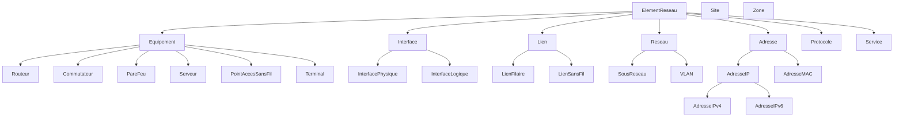

# Modèle conceptuel — Ontologie Réseau V0

Ce document décrit le modèle porté par `ontology/reseau-v0.ttl`. Il sert de
support de discussion à l'équipe. Il ne remplace pas l'ontologie : en cas de
divergence, **le fichier `.ttl` fait foi**.

## 1. Périmètre

Décrire un réseau informatique / télécom : équipements, leur raccordement
physique et logique, l'adressage, la localisation et les services.

**Hors périmètre V0** (candidats pour une V1) : métrologie/supervision,
configuration détaillée (ACL, routes), historisation temporelle, incidents.

## 2. Vue d'ensemble des concepts

`Site` et `Zone` ne dérivent pas de `ElementReseau` : ce sont des contextes
(localisation physique, zone de confiance) et non des éléments du réseau.

## 3. Relations principales

| Relation                | Domaine     | Portée      | Sens |
|-------------------------|-------------|-------------|------|
| `possedeInterface`      | Equipement  | Interface   | un équipement expose des interfaces |
| `interfaceDe` (inverse) | Interface   | Equipement  | fonctionnelle : 1 interface → 1 équipement |
| `aExtremite`            | Lien        | Interface   | un lien relie des interfaces (typ. 2) |
| `connecteA`             | Interface   | Interface   | adjacence directe, **symétrique** |
| `appartientAuReseau`    | Interface   | Reseau      | rattachement à un sous-réseau / VLAN |
| `aAdresse`              | Interface   | Adresse     | IP ou MAC portée par l'interface |
| `localiseA`             | Equipement  | Site        | fonctionnelle : 1 équipement → 1 site |
| `appartientAZone`       | Equipement  | Zone        | zone de sécurité |
| `fournitService`        | Equipement  | Service     | services exposés |
| `utiliseProtocole`      | ElementReseau | Protocole | protocoles mis en œuvre |

## 4. Attributs (propriétés de données)

- Génériques : `nom`, `identifiant`, `actif`
- Équipement : `fabricant`, `modele`, `versionLogiciel`
- Interface physique : `numeroPort`, `debitMbps`
- Adresse : `valeurAdresse`
- Sous-réseau : `adresseReseau`, `prefixeCIDR`
- VLAN : `numeroVLAN`
- Lien : `debitMbps`

## 5. Choix de modélisation à valider en équipe

1. **Adresse comme classe vs. littéral.** V0 modélise l'adresse comme une
   *classe* (`Adresse`) portée via `aAdresse`, ce qui permet de typer IPv4/IPv6/MAC
   et d'y attacher des métadonnées. Alternative plus légère : une simple
   propriété de données `adresseIP` sur l'interface. → à trancher.
2. **`connecteA` vs. `Lien` réifié.** On garde les deux : `connecteA` pour
   l'adjacence rapide, `Lien` pour porter des attributs (débit, type de support).
   Faut-il rendre l'un dérivable de l'autre (règle SWRL / SHACL) ?
3. **Cardinalité des liens.** Faut-il contraindre un `Lien` à exactement 2
   extrémités (point-à-point) ou autoriser le multipoint ?
4. **Espace de noms.** `http://example.org/reseau/v0#` est provisoire (voir
   CONTRIBUTING.md).

## 6. Prochaines étapes envisagées

- Ajouter des contraintes **SHACL** de validation (formats d'adresses, VLAN 1–4094).
- Aligner sur un vocabulaire existant si pertinent (ex. schémas réseau standards).
- Enrichir : services applicatifs, dépendances, supervision.
